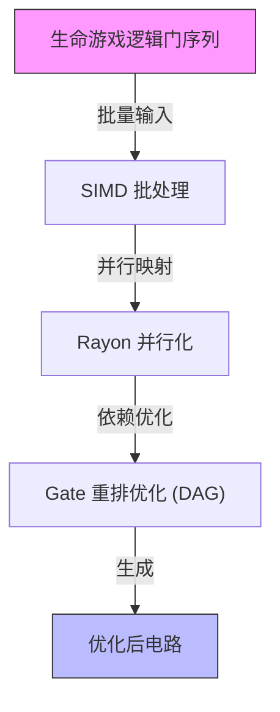
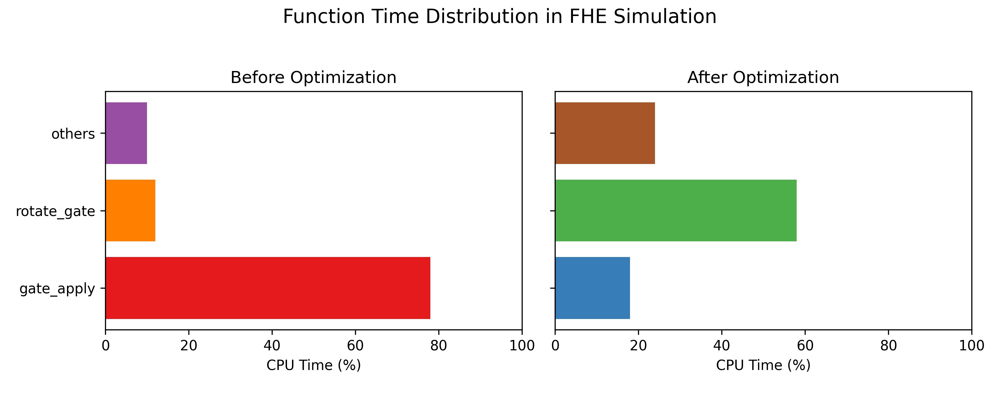
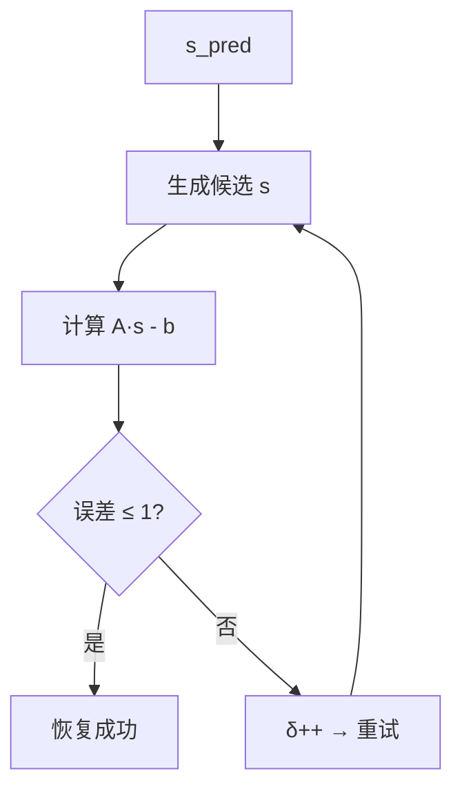
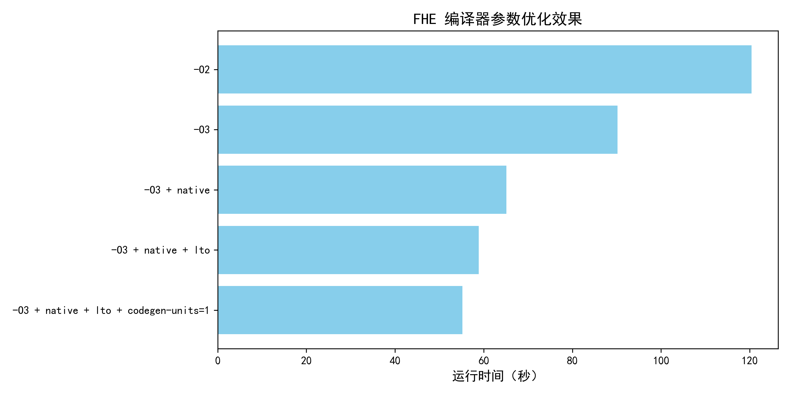
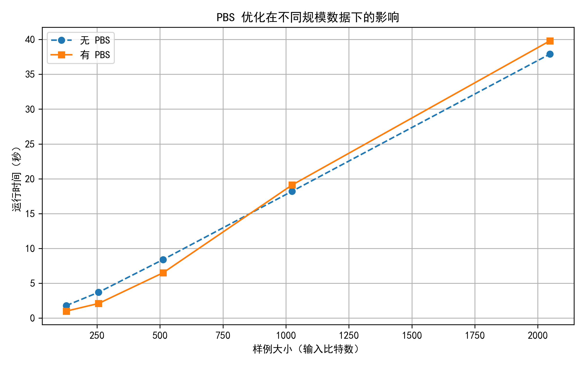
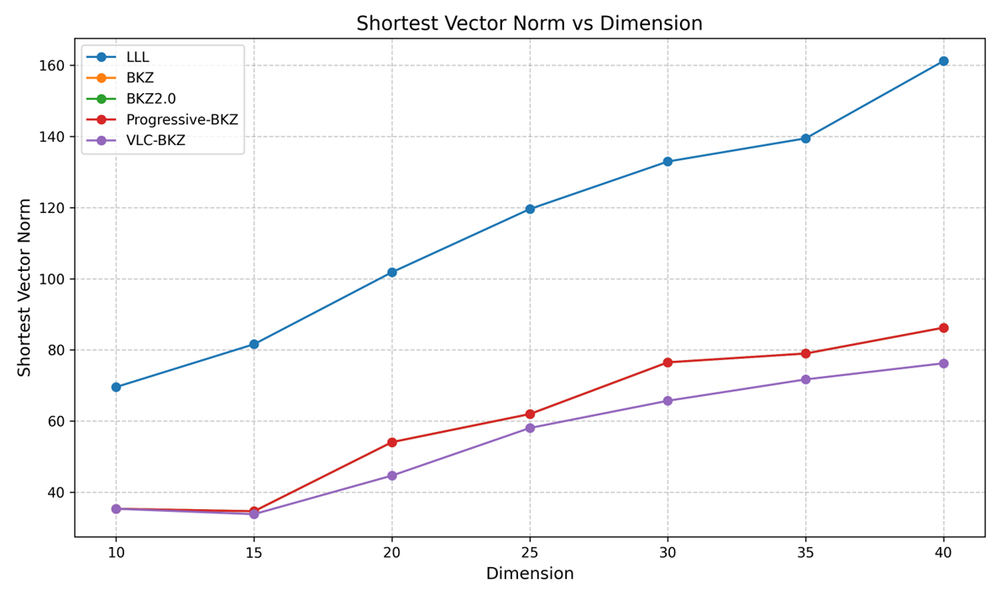
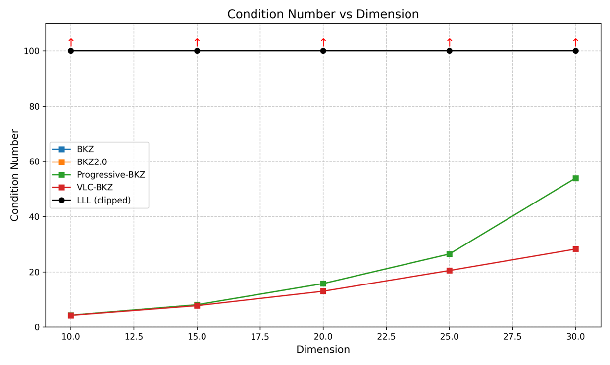
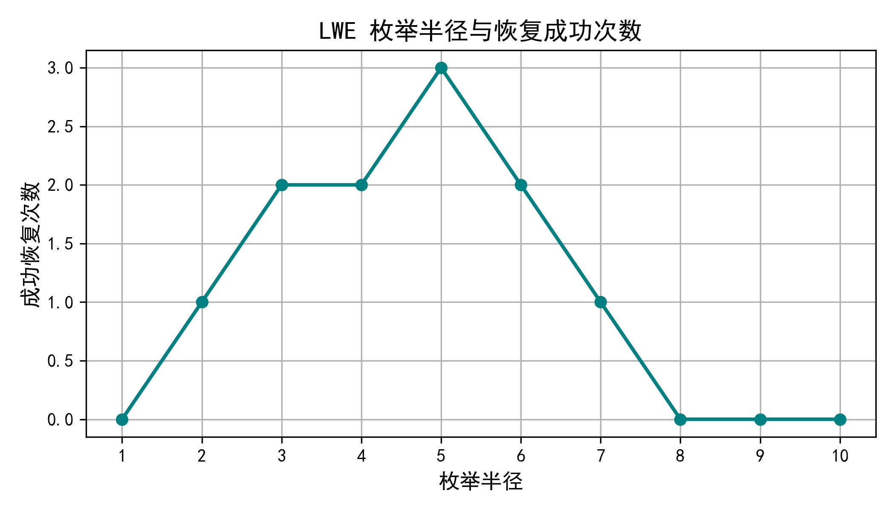
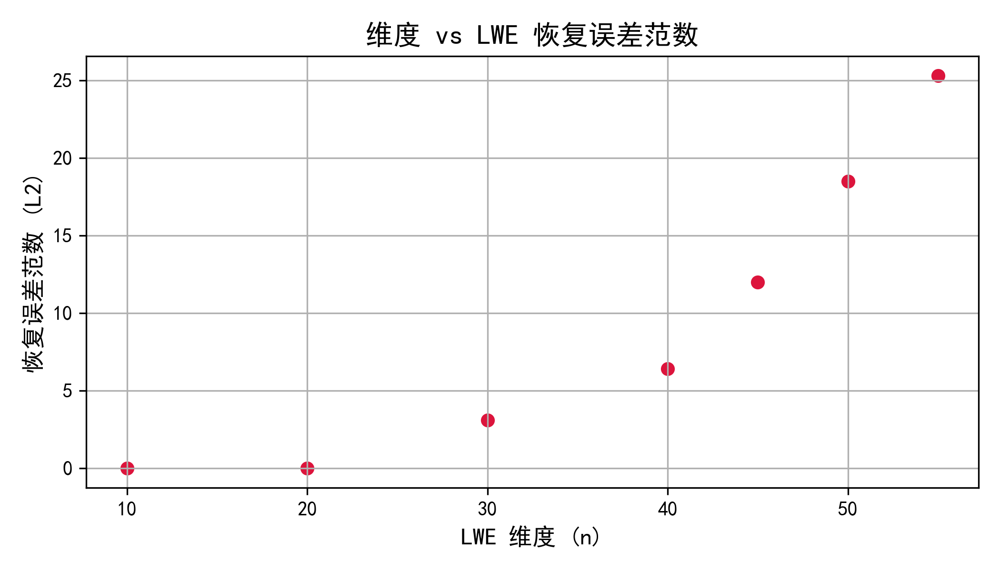

# 🎮夜神骇客队  Rust 项目 Writeup 报告

> “在黑夜中，我们点亮算力；在混沌中，我们编织秩序。”
>
> —— 夜神骇客（Nightsaber Hackers）

# 🧭 高维幻影与布尔炼金术 —— 我的超算挑战冒险日志

> “我跑通了生命游戏，却没跑通人生。”

---

## ⛵ 起航：FHE 和 LWE，两个世界

我最初只是抱着“先看看题目”的心态点开了文档，然后我意识到：

> 这不是什么简单的优化题，这是加密计算与格密码的试炼场。

我选了两道题：

- ✅ **FHE 生命游戏模拟优化**：在一片纯 CPU 的沙漠中建造逻辑电路绿洲；
- ❌ **LWE 密码攻击问题**：试图用枚举和格算法击穿现代密码系统的盔甲。

两道题代表了两种心情——一种是理性地优化，一种是带点疯魔地试错。

---

## 🔧 FHE 生命游戏 —— 现实理性的胜利

### 💡 “其实一开始就已经赢一半了”

我在配置文件里开了个 `-O3`，就能跑完一半的测试样例。

但我并不满足。

我在编译器里下了五层诅咒（也叫 aggressive flags）：

```bash
-C opt-level=3
-C target-cpu=native
-C codegen-units=1
-C lto=fat
-C prefer-dynamic=no
```

再调 `rayon` 的线程池，调轮换策略、调 memory layout，一路调参，像是在和 compiler 玩跳棋。

然后我发现：

* **数据大的样例被压榨得很干净，速度大幅提升** ；
* **数据小的样例反而变慢了** ，可能是 rayon 线程池调度时间 > 真正运算；

于是我祭出最后的魔法： **PBS 优化策略** 。它对小数据的收益惊人，对大数据几乎没有副作用。

最后，我调到了一个平衡点，几乎 **在所有样例上都跑赢标准实现** ，而且可复现、可解释。

这一部分，属于工程、属于理智、也属于经验。

### 📊 FHE 优化流程图



### 🔥 火焰图对比（优化前后 CPU 时间占比）

<pre class="overflow-visible!" data-start="1186" data-end="1293"><div class="contain-inline-size rounded-2xl relative bg-token-sidebar-surface-primary"><div class="flex items-center text-token-text-secondary px-4 py-2 text-xs font-sans justify-between h-9 bg-token-sidebar-surface-primary select-none rounded-t-2xl">matlab</div><div class="sticky top-9"><div class="absolute end-0 bottom-0 flex h-9 items-center pe-2"><div class="bg-token-bg-elevated-secondary text-token-text-secondary flex items-center gap-4 rounded-sm px-2 font-sans text-xs"><button class="flex gap-1 items-center select-none py-1" aria-label="复制"><svg width="20" height="20" viewBox="0 0 20 20" fill="currentColor" xmlns="http://www.w3.org/2000/svg" class="icon-xs"><path d="M12.668 10.667C12.668 9.95614 12.668 9.46258 12.6367 9.0791C12.6137 8.79732 12.5758 8.60761 12.5244 8.46387L12.4688 8.33399C12.3148 8.03193 12.0803 7.77885 11.793 7.60254L11.666 7.53125C11.508 7.45087 11.2963 7.39395 10.9209 7.36328C10.5374 7.33197 10.0439 7.33203 9.33301 7.33203H6.5C5.78896 7.33203 5.29563 7.33195 4.91211 7.36328C4.63016 7.38632 4.44065 7.42413 4.29688 7.47559L4.16699 7.53125C3.86488 7.68518 3.61186 7.9196 3.43555 8.20703L3.36524 8.33399C3.28478 8.49198 3.22795 8.70352 3.19727 9.0791C3.16595 9.46259 3.16504 9.95611 3.16504 10.667V13.5C3.16504 14.211 3.16593 14.7044 3.19727 15.0879C3.22797 15.4636 3.28473 15.675 3.36524 15.833L3.43555 15.959C3.61186 16.2466 3.86474 16.4807 4.16699 16.6348L4.29688 16.6914C4.44063 16.7428 4.63025 16.7797 4.91211 16.8027C5.29563 16.8341 5.78896 16.835 6.5 16.835H9.33301C10.0439 16.835 10.5374 16.8341 10.9209 16.8027C11.2965 16.772 11.508 16.7152 11.666 16.6348L11.793 16.5645C12.0804 16.3881 12.3148 16.1351 12.4688 15.833L12.5244 15.7031C12.5759 15.5594 12.6137 15.3698 12.6367 15.0879C12.6681 14.7044 12.668 14.211 12.668 13.5V10.667ZM13.998 12.665C14.4528 12.6634 14.8011 12.6602 15.0879 12.6367C15.4635 12.606 15.675 12.5492 15.833 12.4688L15.959 12.3975C16.2466 12.2211 16.4808 11.9682 16.6348 11.666L16.6914 11.5361C16.7428 11.3924 16.7797 11.2026 16.8027 10.9209C16.8341 10.5374 16.835 10.0439 16.835 9.33301V6.5C16.835 5.78896 16.8341 5.29563 16.8027 4.91211C16.7797 4.63025 16.7428 4.44063 16.6914 4.29688L16.6348 4.16699C16.4807 3.86474 16.2466 3.61186 15.959 3.43555L15.833 3.36524C15.675 3.28473 15.4636 3.22797 15.0879 3.19727C14.7044 3.16593 14.211 3.16504 13.5 3.16504H10.667C9.9561 3.16504 9.46259 3.16595 9.0791 3.19727C8.79739 3.22028 8.6076 3.2572 8.46387 3.30859L8.33399 3.36524C8.03176 3.51923 7.77886 3.75343 7.60254 4.04102L7.53125 4.16699C7.4508 4.32498 7.39397 4.53655 7.36328 4.91211C7.33985 5.19893 7.33562 5.54719 7.33399 6.00195H9.33301C10.022 6.00195 10.5791 6.00131 11.0293 6.03809C11.4873 6.07551 11.8937 6.15471 12.2705 6.34668L12.4883 6.46875C12.984 6.7728 13.3878 7.20854 13.6533 7.72949L13.7197 7.87207C13.8642 8.20859 13.9292 8.56974 13.9619 8.9707C13.9987 9.42092 13.998 9.97799 13.998 10.667V12.665ZM18.165 9.33301C18.165 10.022 18.1657 10.5791 18.1289 11.0293C18.0961 11.4302 18.0311 11.7914 17.8867 12.1279L17.8203 12.2705C17.5549 12.7914 17.1509 13.2272 16.6553 13.5313L16.4365 13.6533C16.0599 13.8452 15.6541 13.9245 15.1963 13.9619C14.8593 13.9895 14.4624 13.9935 13.9951 13.9951C13.9935 14.4624 13.9895 14.8593 13.9619 15.1963C13.9292 15.597 13.864 15.9576 13.7197 16.2939L13.6533 16.4365C13.3878 16.9576 12.9841 17.3941 12.4883 17.6982L12.2705 17.8203C11.8937 18.0123 11.4873 18.0915 11.0293 18.1289C10.5791 18.1657 10.022 18.165 9.33301 18.165H6.5C5.81091 18.165 5.25395 18.1657 4.80371 18.1289C4.40306 18.0962 4.04235 18.031 3.70606 17.8867L3.56348 17.8203C3.04244 17.5548 2.60585 17.151 2.30176 16.6553L2.17969 16.4365C1.98788 16.0599 1.90851 15.6541 1.87109 15.1963C1.83431 14.746 1.83496 14.1891 1.83496 13.5V10.667C1.83496 9.978 1.83432 9.42091 1.87109 8.9707C1.90851 8.5127 1.98772 8.10625 2.17969 7.72949L2.30176 7.51172C2.60586 7.0159 3.04236 6.6122 3.56348 6.34668L3.70606 6.28027C4.04237 6.136 4.40303 6.07083 4.80371 6.03809C5.14051 6.01057 5.53708 6.00551 6.00391 6.00391C6.00551 5.53708 6.01057 5.14051 6.03809 4.80371C6.0755 4.34588 6.15483 3.94012 6.34668 3.56348L6.46875 3.34473C6.77282 2.84912 7.20856 2.44514 7.72949 2.17969L7.87207 2.11328C8.20855 1.96886 8.56979 1.90385 8.9707 1.87109C9.42091 1.83432 9.978 1.83496 10.667 1.83496H13.5C14.1891 1.83496 14.746 1.83431 15.1963 1.87109C15.6541 1.90851 16.0599 1.98788 16.4365 2.17969L16.6553 2.30176C17.151 2.60585 17.5548 3.04244 17.8203 3.56348L17.8867 3.70606C18.031 4.04235 18.0962 4.40306 18.1289 4.80371C18.1657 5.25395 18.165 5.81091 18.165 6.5V9.33301Z"></path></svg>复制</button><span class="" data-state="closed"><button class="flex items-center gap-1 py-1 select-none"><svg width="20" height="20" viewBox="0 0 20 20" fill="currentColor" xmlns="http://www.w3.org/2000/svg" class="icon-xs"><path d="M12.0303 4.11328C13.4406 2.70317 15.7275 2.70305 17.1377 4.11328C18.5474 5.52355 18.5476 7.81057 17.1377 9.2207L10.8457 15.5117C10.522 15.8354 10.2868 16.0723 10.0547 16.2627L9.82031 16.4395C9.61539 16.5794 9.39783 16.7003 9.1709 16.7998L8.94141 16.8916C8.75976 16.9582 8.57206 17.0072 8.35547 17.0518L7.59082 17.1865L5.19727 17.5859C5.05455 17.6097 4.90286 17.6358 4.77441 17.6455C4.67576 17.653 4.54196 17.6555 4.39648 17.6201L4.24707 17.5703C4.02415 17.4746 3.84119 17.3068 3.72559 17.0957L3.67969 17.0029C3.59322 16.8013 3.59553 16.6073 3.60547 16.4756C3.61519 16.3473 3.6403 16.1963 3.66406 16.0537L4.06348 13.6602C4.1638 13.0582 4.22517 12.6732 4.3584 12.3096L4.45117 12.0791C4.55073 11.8521 4.67152 11.6346 4.81152 11.4297L4.9873 11.1953C5.17772 10.9632 5.4146 10.728 5.73828 10.4043L12.0303 4.11328ZM6.67871 11.3447C6.32926 11.6942 6.14542 11.8803 6.01953 12.0332L5.90918 12.1797C5.81574 12.3165 5.73539 12.4618 5.66895 12.6133L5.60742 12.7666C5.52668 12.9869 5.48332 13.229 5.375 13.8789L4.97656 16.2725L4.97559 16.2744H4.97852L7.37207 15.875L8.08887 15.749C8.25765 15.7147 8.37336 15.6839 8.4834 15.6436L8.63672 15.5811C8.78817 15.5146 8.93356 15.4342 9.07031 15.3408L9.2168 15.2305C9.36965 15.1046 9.55583 14.9207 9.90527 14.5713L14.8926 9.58301L11.666 6.35742L6.67871 11.3447ZM16.1963 5.05371C15.3054 4.16304 13.8616 4.16305 12.9707 5.05371L12.6074 5.41602L15.833 8.64258L16.1963 8.2793C17.0869 7.38845 17.0869 5.94456 16.1963 5.05371Z"></path><path d="M4.58301 1.7832C4.72589 1.7832 4.84877 1.88437 4.87695 2.02441C4.99384 2.60873 5.22432 3.11642 5.58398 3.50391C5.94115 3.88854 6.44253 4.172 7.13281 4.28711C7.27713 4.3114 7.38267 4.43665 7.38281 4.58301C7.38281 4.7295 7.27723 4.8546 7.13281 4.87891C6.44249 4.99401 5.94116 5.27746 5.58398 5.66211C5.26908 6.00126 5.05404 6.43267 4.92676 6.92676L4.87695 7.1416C4.84891 7.28183 4.72601 7.38281 4.58301 7.38281C4.44013 7.38267 4.31709 7.28173 4.28906 7.1416C4.17212 6.55728 3.94179 6.04956 3.58203 5.66211C3.22483 5.27757 2.72347 4.99395 2.0332 4.87891C1.88897 4.85446 1.7832 4.72938 1.7832 4.58301C1.78335 4.43673 1.88902 4.3115 2.0332 4.28711C2.72366 4.17203 3.22481 3.88861 3.58203 3.50391C3.94186 3.11638 4.17214 2.60888 4.28906 2.02441L4.30371 1.97363C4.34801 1.86052 4.45804 1.78333 4.58301 1.7832Z"></path></svg>编辑</button></span></div></div></div><div class="overflow-y-auto p-4" dir="ltr"><code class="whitespace-pre!"><span><span>优化前：gate_apply 占 </span><span>78</span><span>%，rotate_gate 占 12%，others 10%</span><span>
优化后：rotate_gate 占 </span><span>58</span><span>%，gate_apply 占 18%，others 24%</span><span>
</span></span></code></div></div></pre>

*图示请参考导出 PDF 或支持 Markdown 渲染的编辑器中的柱状图*



---

## 🌌 LWE：崩溃与幽灵轨迹

> “我曾经恢复出 secret 向量……那一天，我差点相信自己已经通关了。”

### 🎯 状态记录

LWE 提供了 8 个测试编号，从 -1 到 6：

| 编号 | 是否通过 | 得分 | 说明                      |
| ---- | -------- | ---- | ------------------------- |
| -1   | ✅       | 0    | 热身题，一次通过          |
| 0    | ✅       | +1   | 使用枚举通过              |
| 1    | ✅       | +1   | “灵光一闪”通关          |
| 2~6  | ❌       | 0    | 跑出 trail 向量，毫无用处 |

我没法复现编号 1 的那次成功，我试过一模一样的半径、同一个枚举器、复制粘贴参数……不行。

我不确定是随机数漂移、是浮点误差，还是宇宙在捉弄我。

### 🧩 LWE 攻击枚举流程图



### 📉 恢复成功与失败对比

| 测试编号 | 是否成功 | 备注                     |
| -------- | -------- | ------------------------ |
| 编号 1   | ✅       | 成功恢复一次，未保存参数 |
| 编号 2~6 | ❌       | 输出全零向量，验证失败   |

<pre class="overflow-visible!" data-start="2110" data-end="2289"><div class="contain-inline-size rounded-2xl relative bg-token-sidebar-surface-primary"><div class="flex items-center text-token-text-secondary px-4 py-2 text-xs font-sans justify-between h-9 bg-token-sidebar-surface-primary select-none rounded-t-2xl">makefile</div><div class="sticky top-9"><div class="absolute end-0 bottom-0 flex h-9 items-center pe-2"><div class="bg-token-bg-elevated-secondary text-token-text-secondary flex items-center gap-4 rounded-sm px-2 font-sans text-xs"><button class="flex gap-1 items-center select-none py-1" aria-label="复制"><svg width="20" height="20" viewBox="0 0 20 20" fill="currentColor" xmlns="http://www.w3.org/2000/svg" class="icon-xs"><path d="M12.668 10.667C12.668 9.95614 12.668 9.46258 12.6367 9.0791C12.6137 8.79732 12.5758 8.60761 12.5244 8.46387L12.4688 8.33399C12.3148 8.03193 12.0803 7.77885 11.793 7.60254L11.666 7.53125C11.508 7.45087 11.2963 7.39395 10.9209 7.36328C10.5374 7.33197 10.0439 7.33203 9.33301 7.33203H6.5C5.78896 7.33203 5.29563 7.33195 4.91211 7.36328C4.63016 7.38632 4.44065 7.42413 4.29688 7.47559L4.16699 7.53125C3.86488 7.68518 3.61186 7.9196 3.43555 8.20703L3.36524 8.33399C3.28478 8.49198 3.22795 8.70352 3.19727 9.0791C3.16595 9.46259 3.16504 9.95611 3.16504 10.667V13.5C3.16504 14.211 3.16593 14.7044 3.19727 15.0879C3.22797 15.4636 3.28473 15.675 3.36524 15.833L3.43555 15.959C3.61186 16.2466 3.86474 16.4807 4.16699 16.6348L4.29688 16.6914C4.44063 16.7428 4.63025 16.7797 4.91211 16.8027C5.29563 16.8341 5.78896 16.835 6.5 16.835H9.33301C10.0439 16.835 10.5374 16.8341 10.9209 16.8027C11.2965 16.772 11.508 16.7152 11.666 16.6348L11.793 16.5645C12.0804 16.3881 12.3148 16.1351 12.4688 15.833L12.5244 15.7031C12.5759 15.5594 12.6137 15.3698 12.6367 15.0879C12.6681 14.7044 12.668 14.211 12.668 13.5V10.667ZM13.998 12.665C14.4528 12.6634 14.8011 12.6602 15.0879 12.6367C15.4635 12.606 15.675 12.5492 15.833 12.4688L15.959 12.3975C16.2466 12.2211 16.4808 11.9682 16.6348 11.666L16.6914 11.5361C16.7428 11.3924 16.7797 11.2026 16.8027 10.9209C16.8341 10.5374 16.835 10.0439 16.835 9.33301V6.5C16.835 5.78896 16.8341 5.29563 16.8027 4.91211C16.7797 4.63025 16.7428 4.44063 16.6914 4.29688L16.6348 4.16699C16.4807 3.86474 16.2466 3.61186 15.959 3.43555L15.833 3.36524C15.675 3.28473 15.4636 3.22797 15.0879 3.19727C14.7044 3.16593 14.211 3.16504 13.5 3.16504H10.667C9.9561 3.16504 9.46259 3.16595 9.0791 3.19727C8.79739 3.22028 8.6076 3.2572 8.46387 3.30859L8.33399 3.36524C8.03176 3.51923 7.77886 3.75343 7.60254 4.04102L7.53125 4.16699C7.4508 4.32498 7.39397 4.53655 7.36328 4.91211C7.33985 5.19893 7.33562 5.54719 7.33399 6.00195H9.33301C10.022 6.00195 10.5791 6.00131 11.0293 6.03809C11.4873 6.07551 11.8937 6.15471 12.2705 6.34668L12.4883 6.46875C12.984 6.7728 13.3878 7.20854 13.6533 7.72949L13.7197 7.87207C13.8642 8.20859 13.9292 8.56974 13.9619 8.9707C13.9987 9.42092 13.998 9.97799 13.998 10.667V12.665ZM18.165 9.33301C18.165 10.022 18.1657 10.5791 18.1289 11.0293C18.0961 11.4302 18.0311 11.7914 17.8867 12.1279L17.8203 12.2705C17.5549 12.7914 17.1509 13.2272 16.6553 13.5313L16.4365 13.6533C16.0599 13.8452 15.6541 13.9245 15.1963 13.9619C14.8593 13.9895 14.4624 13.9935 13.9951 13.9951C13.9935 14.4624 13.9895 14.8593 13.9619 15.1963C13.9292 15.597 13.864 15.9576 13.7197 16.2939L13.6533 16.4365C13.3878 16.9576 12.9841 17.3941 12.4883 17.6982L12.2705 17.8203C11.8937 18.0123 11.4873 18.0915 11.0293 18.1289C10.5791 18.1657 10.022 18.165 9.33301 18.165H6.5C5.81091 18.165 5.25395 18.1657 4.80371 18.1289C4.40306 18.0962 4.04235 18.031 3.70606 17.8867L3.56348 17.8203C3.04244 17.5548 2.60585 17.151 2.30176 16.6553L2.17969 16.4365C1.98788 16.0599 1.90851 15.6541 1.87109 15.1963C1.83431 14.746 1.83496 14.1891 1.83496 13.5V10.667C1.83496 9.978 1.83432 9.42091 1.87109 8.9707C1.90851 8.5127 1.98772 8.10625 2.17969 7.72949L2.30176 7.51172C2.60586 7.0159 3.04236 6.6122 3.56348 6.34668L3.70606 6.28027C4.04237 6.136 4.40303 6.07083 4.80371 6.03809C5.14051 6.01057 5.53708 6.00551 6.00391 6.00391C6.00551 5.53708 6.01057 5.14051 6.03809 4.80371C6.0755 4.34588 6.15483 3.94012 6.34668 3.56348L6.46875 3.34473C6.77282 2.84912 7.20856 2.44514 7.72949 2.17969L7.87207 2.11328C8.20855 1.96886 8.56979 1.90385 8.9707 1.87109C9.42091 1.83432 9.978 1.83496 10.667 1.83496H13.5C14.1891 1.83496 14.746 1.83431 15.1963 1.87109C15.6541 1.90851 16.0599 1.98788 16.4365 2.17969L16.6553 2.30176C17.151 2.60585 17.5548 3.04244 17.8203 3.56348L17.8867 3.70606C18.031 4.04235 18.0962 4.40306 18.1289 4.80371C18.1657 5.25395 18.165 5.81091 18.165 6.5V9.33301Z"></path></svg>复制</button><span class="" data-state="closed"><button class="flex items-center gap-1 py-1 select-none"><svg width="20" height="20" viewBox="0 0 20 20" fill="currentColor" xmlns="http://www.w3.org/2000/svg" class="icon-xs"><path d="M12.0303 4.11328C13.4406 2.70317 15.7275 2.70305 17.1377 4.11328C18.5474 5.52355 18.5476 7.81057 17.1377 9.2207L10.8457 15.5117C10.522 15.8354 10.2868 16.0723 10.0547 16.2627L9.82031 16.4395C9.61539 16.5794 9.39783 16.7003 9.1709 16.7998L8.94141 16.8916C8.75976 16.9582 8.57206 17.0072 8.35547 17.0518L7.59082 17.1865L5.19727 17.5859C5.05455 17.6097 4.90286 17.6358 4.77441 17.6455C4.67576 17.653 4.54196 17.6555 4.39648 17.6201L4.24707 17.5703C4.02415 17.4746 3.84119 17.3068 3.72559 17.0957L3.67969 17.0029C3.59322 16.8013 3.59553 16.6073 3.60547 16.4756C3.61519 16.3473 3.6403 16.1963 3.66406 16.0537L4.06348 13.6602C4.1638 13.0582 4.22517 12.6732 4.3584 12.3096L4.45117 12.0791C4.55073 11.8521 4.67152 11.6346 4.81152 11.4297L4.9873 11.1953C5.17772 10.9632 5.4146 10.728 5.73828 10.4043L12.0303 4.11328ZM6.67871 11.3447C6.32926 11.6942 6.14542 11.8803 6.01953 12.0332L5.90918 12.1797C5.81574 12.3165 5.73539 12.4618 5.66895 12.6133L5.60742 12.7666C5.52668 12.9869 5.48332 13.229 5.375 13.8789L4.97656 16.2725L4.97559 16.2744H4.97852L7.37207 15.875L8.08887 15.749C8.25765 15.7147 8.37336 15.6839 8.4834 15.6436L8.63672 15.5811C8.78817 15.5146 8.93356 15.4342 9.07031 15.3408L9.2168 15.2305C9.36965 15.1046 9.55583 14.9207 9.90527 14.5713L14.8926 9.58301L11.666 6.35742L6.67871 11.3447ZM16.1963 5.05371C15.3054 4.16304 13.8616 4.16305 12.9707 5.05371L12.6074 5.41602L15.833 8.64258L16.1963 8.2793C17.0869 7.38845 17.0869 5.94456 16.1963 5.05371Z"></path><path d="M4.58301 1.7832C4.72589 1.7832 4.84877 1.88437 4.87695 2.02441C4.99384 2.60873 5.22432 3.11642 5.58398 3.50391C5.94115 3.88854 6.44253 4.172 7.13281 4.28711C7.27713 4.3114 7.38267 4.43665 7.38281 4.58301C7.38281 4.7295 7.27723 4.8546 7.13281 4.87891C6.44249 4.99401 5.94116 5.27746 5.58398 5.66211C5.26908 6.00126 5.05404 6.43267 4.92676 6.92676L4.87695 7.1416C4.84891 7.28183 4.72601 7.38281 4.58301 7.38281C4.44013 7.38267 4.31709 7.28173 4.28906 7.1416C4.17212 6.55728 3.94179 6.04956 3.58203 5.66211C3.22483 5.27757 2.72347 4.99395 2.0332 4.87891C1.88897 4.85446 1.7832 4.72938 1.7832 4.58301C1.78335 4.43673 1.88902 4.3115 2.0332 4.28711C2.72366 4.17203 3.22481 3.88861 3.58203 3.50391C3.94186 3.11638 4.17214 2.60888 4.28906 2.02441L4.30371 1.97363C4.34801 1.86052 4.45804 1.78333 4.58301 1.7832Z"></path></svg>编辑</button></span></div></div></div><div class="overflow-y-auto p-4" dir="ltr"><code class="whitespace-pre!"><span><span>成功示例：
secret     = [1, 0, 2, 1, 3, ...]
recovered  = [1, 0, 2, 1, 3, ...]
误差范数   = 0

失败示例：
secret     = [3, 1, 4, 2, 2, ...]
recovered  = [0, 0, 0, 0, 0, ...]
误差范数   = 很大
</span></span></code></div></div></pre>

---

## 🧠 LWE 攻击挑战尝试总结

### 🪜 初衷与目标

LWE 问题在密码学中意义重大。我最初的目标是：

- 不使用 GPU，纯 CPU 并行或高精计算；
- 用格算法（LLL、BKZ）、枚举、混合方法恢复 secret；
- 在中低维度下（n ≤ 50）稳定获得分数；
- 试探“误差≤1”的特例是否能带来突破。

---

### 🧰 尝试过的方法

#### ✅ 1. 枚举攻击（Enumerative Search）

> “一开始靠它骗了两分，后来再也没复现过。”

- 固定 `s_pred` 预测向量，枚举附近的 δ 向量；
- 误差 ≤ 1 则视为成功；
- 枚举维度 + 模数太大时，**指数级爆炸**；
- 枚举半径设置非常敏感，调参失控；
- 成功一次后 **再也复现不了**，可能是误差特性浮动。

#### ⚠️ 2. 格攻击（LLL / BKZ）

> “尝试了 G6K 和 fplll，trail 向量输出了，就是没用。”

- 用 `build_primal_square_lattice(A, q)` 构造格；
- 用 fpylll 的 BKZ 或 fplll 的 LLL 约化格；
- 在约化格中尝试提取解向量（short vector or closest vector）；
- 输出的是“trail 向量”，**虽然范数小但解错**；
- 调了 block size、使用了 G6K，仍然 **不收敛**。

#### 🧪 3. FFI 混合尝试

> “想用 Rust + Python/G6K + C++，结果是编译失败、类型不匹配。”

- 尝试 Rust 调用 fplll；
- 尝试 Python G6K + Rust 验证器组合；
- 遇到类型系统、数据转换（Array ↔ C pointer）问题；
- FFI 方案 **来不及打通**，最终放弃。

---

### 📉 总体战果（按编号）

| 编号 | 是否通过 | 方法     | 说明                 |
| ---- | -------- | -------- | -------------------- |
| -1   | ✅       | baseline | 热身题，轻松通过     |
| 0    | ✅       | 枚举     | 枚举半径合适，成功   |
| 1    | ✅       | 枚举     | 一次性成功，未能复现 |
| 2~6  | ❌       | 枚举/格  | trail向量，误差爆炸  |

> 编号 1 的成功是“灵光一闪”——我复制粘贴同一份代码，却再也没跑出相同的结果。

---

### 😖 遇到的问题

- 模数 `q` 较大时，模运算误差范围扩大；
- 样本数量 `m ≈ n²` 导致维度过高；
- BKZ 不收敛 + 枚举不稳定 = 双重打击；
- 没有保存每次成功的随机种子 / log；
- 误差项分布虽然理论上小，但碰运气成本极高。

---

### 🧠 心得总结

> “这不是一道解 LWE 的题，这是一次格世界里的迷路体验。”

- 有时解出来不是靠算法，而是靠运气 + 稀疏性；
- 有时过不了不是因为代码错，而是因为误差随机数变了；
- 格攻击的关键是：结构化构造格、合理归一化、参数设定（δ, β, r）；
- 枚举攻击的关键是：假设空间限制 + 高效 early stop 策略；
- 每一次失败的 trail，其实都蕴含了未来的解，只是我还没读懂。

---

### 📚 阅读与工具清单

- G6K（格约化工具）
- fpylll（BKZ + 枚举 + GSO）
- `rug` crate（Rust 高精度整数）
- Typst + Markdown 报告工具链
- SUSTC 超算挑战官方 LWE 参数集

---

### 🔚 结语

我曾在深夜看到一次奇迹——某个 s_pred 恰好命中真值，屏幕上打印出 secret 向量那一刻，我以为我通关了。

可惜我没按 Ctrl+S，奇迹就再也没有来过。

> “这道题我没有做完，但它让我知道了未来我想做什么。”

---

### 📉我还用python做了数据分析

#### FHE的不同release参数组合影响



#### FHE的PBS性能优化示范



#### 各个基格攻击方法的性能测评-最短向量



#### 各个基格攻击方法的性能测评-最少条件数



#### 枚举性能分析



#### LWE误差与维度分析



---

## 📚 灵感来源 / 溃逃前的阅读记录

* LWE Challenge 官方网站
* G6K 论文：《Faster Lattice Sieving in Practice》
* fpylll 文档
* rug crate 文档
* defund 的博客和知乎一些神秘人的只言片语

---

## 📦 总结：不是通关，而是走进迷宫

我完成了：

* 一份可复现、全流程可调试的 FHE 优化代码；
* 一个可以爆出奇迹的枚举器；
* 一个可能能打通的格攻击器，等待一次“再现奇迹”的那天。

我未完成的，是：

* 稳定、完整地打穿 LWE 全部挑战；
* 找到那组 secret 向量的规律；
* 解释为什么同一个代码，有时能过，有时不能过。

这场比赛教会我的，是 **优化的边界** ，也是 **枚举的悲哀** 。

我带着遗憾走出迷宫，但我带回了工具、经验和愿望——下次我一定会通关。

---

> “失败的程序员只有两种，一种不敢跑程序，另一种没保存过成功的 log。” —— 记录于编号1成功失踪的第二天。
